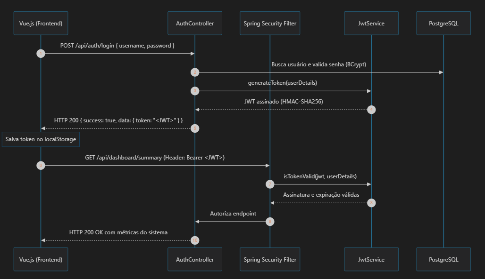

# Monitoramento Embarcado

Aplicação monolítica para monitoramento de internet, disco e câmeras com dashboard e alertas.

## Stack

- Java 17
- Spring Boot 3.3.x
- Spring MVC
- Spring Security
- Spring Data JPA + Hibernate
- PostgreSQL
- Flyway
- Maven
- Vue 3 + TypeScript + Vite
- Axios
- Swagger / OpenAPI
- Docker Compose

## Estrutura do projeto

- backend/: API Java + Spring Boot
- frontend/: interface em Vue
- docker-compose.yml: PostgreSQL, backend e frontend
- backend/src/main/resources/db/migration/: scripts Flyway

## Arquitetura

A aplicação usa uma arquitetura monolítica em camadas com padrão MVC simplificado:

- controller: expõe endpoints REST
- service: regra de negócio e orquestração
- repository: acesso ao banco
- entity: modelos JPA
- dto: transporte de dados
- config: segurança, CORS e configuração geral

### Comunicação REST entre frontend e backend

O frontend Vue concentra a comunicação HTTP em `frontend/src/services/api.ts`. A instância do Axios usa a base `http://localhost:8080/api`, timeout de 15 segundos e um interceptor que lê o token `monitoramento-token` do `localStorage`. Quando há token, o interceptor envia o cabeçalho `Authorization: Bearer <token>` em cada requisição autenticada.

No backend, os controllers anotados com `@RestController` expõem os recursos de autenticação, câmeras, configuração, monitoramentos, alertas, dashboard e streaming. Eles recebem a requisição, validam o limite HTTP e delegam a regra de negócio aos serviços. Os serviços orquestram entidades e repositórios Spring Data JPA, enquanto os DTOs evitam acoplamento direto entre o contrato REST e o modelo de persistência. As respostas usam o formato compartilhado `ApiResponse`, e exceções de negócio são tratadas centralmente por `GlobalExceptionHandler`.

Esse fluxo mantém a interface desacoplada das regras internas: uma tela chama um endpoint REST, o controller direciona a operação ao serviço, o serviço consulta ou persiste dados pelo repositório e a resposta retorna ao Vue em JSON. A documentação interativa desses contratos está disponível no Swagger/OpenAPI.

### Autenticação JWT



O login começa com `POST /api/auth/login`, enviando `username` e `password`. O `AuthController` consulta o usuário no PostgreSQL e valida a senha com BCrypt. Quando as credenciais são válidas, `JwtService` gera um token assinado com HMAC-SHA256, contendo o nome de usuário no `subject`, as permissões em `roles`, as datas de emissão e expiração. A resposta devolve o token no campo `data.token` de `ApiResponse`.

No frontend, `LoginView.vue` guarda o token em `localStorage` como `monitoramento-token`, junto ao sinalizador local `monitoramento-auth` e ao nome de usuário. A configuração compartilhada em `frontend/src/services/api.ts` cria um cliente Axios com `baseURL` em `http://localhost:8080/api` e timeout de 15 segundos. Seu interceptor acrescenta `Authorization: Bearer <token>` às requisições quando o token está disponível. O router marca as telas operacionais com `requiresAuth` e redireciona ao login quando o sinalizador local não está presente.

No backend, `SecurityConfig` desabilita CSRF para a API, habilita CORS e usa `SessionCreationPolicy.STATELESS`; não há sessão HTTP mantida no servidor. As rotas `/api/auth/**`, Swagger/OpenAPI e `/actuator/health` são públicas. As demais exigem autenticação e passam por `JwtAuthenticationFilter` antes do filtro padrão de usuário e senha. O filtro extrai o Bearer token, recupera o usuário, verifica assinatura e expiração, e só então preenche o contexto de segurança do Spring. Um token inválido, expirado ou ausente não cria contexto autenticado, fazendo com que a rota protegida seja rejeitada.

A chave e a duração do token ficam em `backend/src/main/resources/application.yml`, nas propriedades `app.jwt.secret` e `app.jwt.expiration-ms`. A configuração padrão expira o token em 86.400.000 ms, ou 24 horas. Em ambientes reais, a chave deve ser fornecida por variável ou gerenciador de segredos, em vez de permanecer como valor padrão versionado no arquivo de configuração.

O monitoramento é executado por scheduler e segue um ciclo de:

1. execução do check
2. persistência do resultado
3. avaliação de estado
4. geração ou resolução de alerta

## Domínio e relacionamentos

O domínio é composto por recursos configuráveis, suas leituras históricas, alertas operacionais e sessões de streaming:

- `configuracao`: mantém o destino e timeout do teste de internet, os períodos planejados de coleta e o percentual que dispara alerta de disco. A aplicação consulta a configuração mais recente para cada check.
- `camera`: representa cada câmera cadastrada, com endereço IP, portas HTTP e RTSP, credenciais e indicação de atividade. Somente câmeras ativas entram no ciclo automático.
- `monitoramento_internet`: armazena cada tentativa de conexão, status, tempo de resposta, mensagem de erro e horário da execução.
- `monitoramento_disco`: armazena o espaço total, usado e livre, além do percentual calculado para cada leitura.
- `monitoramento_camera`: registra o resultado de conectividade e captura de frame de uma câmera, com os tempos e eventual erro.
- `alerta`: representa incidentes de internet, disco ou câmera, com severidade, status, mensagem e data de resolução.
- `usuario`: representa os usuários autenticados, com credencial armazenada de forma protegida, perfil e situação de habilitação.
- `stream_session`: registra o ciclo de vida de uma sessão de transmissão iniciada por um usuário para uma câmera.

Os relacionamentos de domínio são `camera 1:N monitoramento_camera`, `camera 1:N alerta`, `camera 1:N stream_session` e `usuario 1:N stream_session`. As colunas `camera_id` e `user_id` registram esses vínculos; a migration inicial os mantém como referências lógicas, sem declarar restrições de chave estrangeira no banco. Os monitoramentos não sobrescrevem o estado anterior: cada execução cria um registro novo, preservando histórico para o dashboard e investigação de incidentes.

## Motor de estados

A máquina de estados centraliza a transição do recurso entre estados:

- ONLINE
- OFFLINE
- ALERT_OPEN
- RECOVERED

Regra principal:

- recurso saudável e anterior em alerta => RECOVERED
- recurso saudável e anterior estável => ONLINE
- recurso indisponível e anterior estável => ALERT_OPEN
- recurso indisponível e anterior em alerta => OFFLINE

### Por que usar uma máquina de Mealy

O monitoramento não toma decisões apenas pelo resultado isolado do check atual. Um mesmo resultado `healthy` ou `unhealthy` pode representar operação normal, abertura de incidente, indisponibilidade persistente ou recuperação, conforme o estado anterior do recurso. Por isso, foi adotado um modelo de máquina de estados no estilo Mealy: a saída da decisão é definida pela combinação entre o estado anterior e a entrada atual de saúde do recurso.

Na prática, `MonitoringStateMachine.evaluateCurrentState(previousState, healthy, resourceType)` recebe o estado conhecido e o resultado do check. A transição calculada orienta a ação seguinte do serviço: manter a operação normal, abrir um alerta, preservar o incidente aberto ou resolvê-lo. Separar essa decisão da coleta de internet, disco e câmera evita que cada monitoramento implemente regras de alerta diferentes para o mesmo problema.

Essa escolha melhora a aplicação em quatro pontos:

- evita alertas duplicados durante uma indisponibilidade persistente, pois apenas a transição para `ALERT_OPEN` abre um novo incidente;
- identifica a recuperação como uma transição explícita, permitindo registrar `resolved_at` e distinguir retorno à normalidade de uma leitura saudável comum;
- padroniza o comportamento entre recursos, facilitando incluir novas fontes de monitoramento sem duplicar a regra de transição;
- torna a regra determinística e testável: para cada par de estado anterior e entrada `healthy`, há um estado esperado.

A lógica fica em `MonitoringStateMachine` e é reutilizada por internet e câmeras. Na transição para `ALERT_OPEN`, o serviço consulta se já existe um alerta aberto para o recurso antes de criar outro, evitando duplicidade a cada execução do scheduler. Na recuperação, o alerta aberto é marcado como `RESOLVED` e recebe `resolved_at`. Para disco, a mesma ideia é aplicada diretamente pela comparação do percentual com o limite configurado: acima do limite abre um alerta, abaixo dele resolve o alerta aberto.

Cada leitura é persistida mesmo quando ocorre falha. Assim, o erro não é apenas um alerta atual: ele também fica registrado na série histórica, com horário, status e dados de diagnóstico, como mensagem de erro ou tempo de resposta. O dashboard consulta essas últimas medições e os alertas abertos para compor a visão operacional.

## Scheduler

A classe `MonitoringScheduler` dispara verificações periódicas:

- internet: 60 segundos
- disco: 120 segundos
- câmeras: 180 segundos

Os checks são executados automaticamente com `@Scheduled(fixedDelayString = ...)`. O valor de `fixedDelay` conta o próximo intervalo a partir do término da execução anterior; portanto, uma execução lenta não se sobrepõe a outra da mesma tarefa. Os períodos padrão são lidos das propriedades `app.monitoring.*.default-period-seconds`, com fallback de 60, 120 e 180 segundos, respectivamente.

Em cada disparo, o scheduler isola exceções com `try/catch` e registra a falha em log, para que um erro pontual não interrompa os próximos ciclos. Internet e disco executam uma coleta por ciclo. Para câmeras, o scheduler busca `findByActiveTrue()` e executa a verificação individualmente para cada câmera ativa. A configuração também armazena períodos por tipo de monitoramento; na implementação atual, o agendamento efetivo é definido pelas propriedades da aplicação, enquanto esses campos são consultados para verificar a existência de configuração.

## Dados capturados do sistema e da rede

### Internet

O serviço obtém o host e o timeout da configuração, com fallback para `8.8.8.8` e 5.000 ms. Ele abre um `Socket` TCP para a porta 80 do host e mede o tempo transcorrido entre o início e o término da conexão. Conexão bem-sucedida gera `ONLINE`; uma `IOException` gera `OFFLINE`, preservando a mensagem técnica do erro. O valor `response_time_ms` permite acompanhar latência percebida pelo processo, enquanto `executed_at` identifica quando a amostra foi coletada.

### Disco

O serviço consulta o sistema de arquivos raiz (`/`) por meio de `java.io.File`. São capturados `total_bytes` e `free_bytes`; o espaço usado é calculado por `total_bytes - free_bytes`, e o percentual é calculado por $used \times 100 / total$. Quando o total é zero, o percentual é definido como zero para evitar divisão por zero. O percentual é comparado ao limite `disk_alert_threshold_percent`, cujo padrão é 85%, para definir a abertura ou resolução do alerta de capacidade.

### Câmeras

Cada câmera ativa passa por duas verificações complementares. Primeiro, uma conexão TCP para o IP da câmera na porta 80 testa a alcançabilidade de rede dentro do timeout configurado. Depois, quando a conectividade é bem-sucedida, a aplicação executa o `ffmpeg` contra a URL RTSP da câmera, usando TCP e solicitando um único frame. A coleta só é marcada como `ONLINE` quando as duas etapas têm sucesso.

O registro de câmera armazena `ping_success`, `frame_capture_success`, os tempos associados quando há sucesso e uma mensagem que diferencia falha de conectividade de falha na captura RTSP. Isso permite distinguir uma câmera inacessível de uma câmera que responde na rede, mas não entrega vídeo. O host que executa o backend precisa ter o `ffmpeg` disponível no `PATH` para que a validação de frame funcione.

## FFmpeg para validação RTSP

O `ffmpeg` é usado exclusivamente para verificar se a câmera entrega vídeo pelo endereço RTSP configurado. O backend executa o binário com transporte RTSP sobre TCP, solicita um único frame e descarta sua saída. A captura é considerada válida somente quando o processo termina com código zero; caso contrário, o monitoramento registra falha de captura e a câmera fica `OFFLINE`.

Em distribuições Debian e Ubuntu, instale e valide a ferramenta no mesmo ambiente que executa o backend:

```bash
sudo apt update
sudo apt install -y ffmpeg
ffmpeg -version
```

O comando `ffmpeg -version` deve estar disponível no `PATH` do processo Java. Ao executar o backend em Docker, a imagem atual não inclui o binário; instale o pacote `ffmpeg` no estágio de execução do `backend/Dockerfile` antes de usar o monitoramento de frame RTSP.

## Banco de dados

O banco padrão é PostgreSQL.

Configuração local em `backend/src/main/resources/application.yml`:

```yaml
spring:
  datasource:
    url: jdbc:postgresql://localhost:5432/monitoramento
    username: postgres
    password: postgres
```

O banco pode ser iniciado com Docker:

```bash
docker compose up -d postgres
```

As migrations estão em:

- backend/src/main/resources/db/migration

O schema inicial cria as tabelas:

- configuracao
- camera
- monitoramento_internet
- monitoramento_disco
- monitoramento_camera
- alerta
- usuario
- stream_session

## Rodando localmente

### 1) Banco

```bash
docker compose up -d postgres
```

### 2) Backend

```bash
cd backend
mvn spring-boot:run
```

### 3) Frontend

```bash
cd frontend
npm install
npm run dev
```

## Acesso

- Frontend: http://localhost:5173
- Backend: http://localhost:8080
- Swagger: http://localhost:8080/swagger-ui/index.html

## Usuário padrão

- username: admin
- password: admin123

## Build

```bash
cd backend
mvn clean package

cd ../frontend
npm install
npm run build
```

## Observações

- O backend usa autenticação básica e login do usuário padrão.
- O frontend faz chamadas para a API no host `http://localhost:8080/api`.
- A estrutura foi pensada para evoluir em um monólito sem quebrar separação por domínio.
